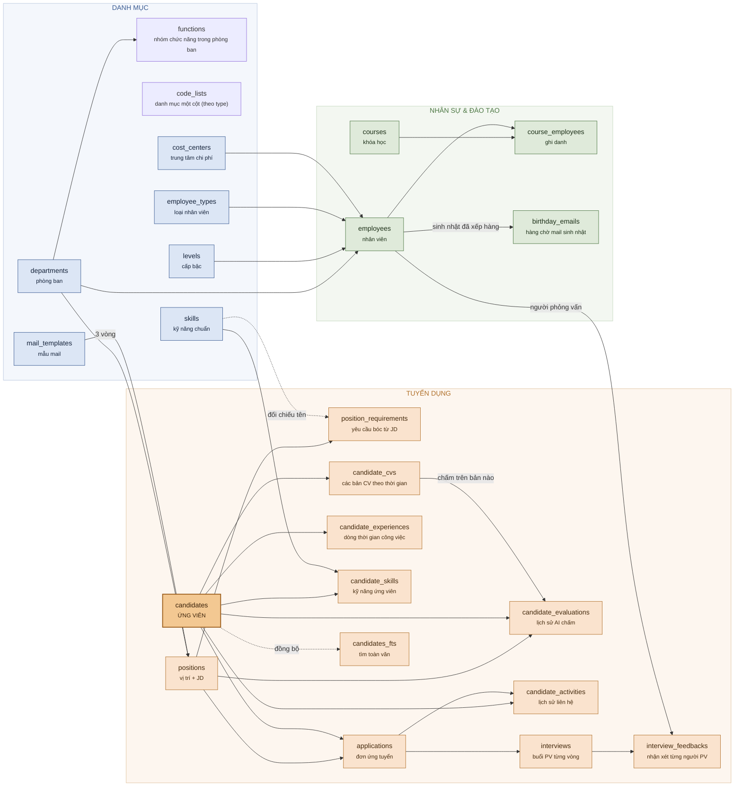
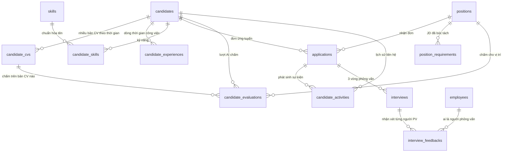

# Thiết kế CSDL — Tuyển dụng & Nhân sự

SQLite · không dùng `FOREIGN KEY` (cột `*_id` là tham chiếu mềm) · mọi cột cho phép NULL trừ khóa chính · mọi bảng có `created_at` + `updated_at` · danh sách nhiều giá trị trong một ô ngăn bởi `;`.

**Mục lục:** [Sơ đồ tổng thể](#sơ-đồ-tổng-thể) · [Bốn bài toán](#bốn-bài-toán-và-lời-giải) · [A. Tuyển dụng](#a--tuyển-dụng) · [B. Danh mục](#b--danh-mục-dùng-chung) · [C. Nhân sự](#c--nhân-sự--đào-tạo) · [Giá trị cố định](#giá-trị-cố-định) · [Migrations](#lịch-sử-thay-đổi-cấu-trúc-migrations)

---

## Sơ đồ tổng thể



Mũi tên = chiều tham chiếu: bảng ở đầu mũi tên chứa cột `*_id` trỏ về bảng ở gốc.
`app_meta` (key-value nội bộ) không vẽ vì không liên quan bảng nào.

---

## Bốn bài toán và lời giải

| Bài toán | Giải bằng | Nguyên tắc |
|---|---|---|
| AI chấm một ứng viên **nhiều lần** (nhiều vị trí, nhiều thời điểm) | `candidate_evaluations` | **Chỉ ghi thêm, không ghi đè.** Không có chỉ mục duy nhất. Mỗi lượt chấm giữ lại `evaluated_at` + `model` + bản CV đã dùng. |
| Ghi **kết quả từng vòng phỏng vấn** và nhận xét của từng người PV | `interviews` + `interview_feedbacks` | Một vòng = một dòng `interviews` (chỉ phần hành chính: ngày giờ, kết luận chung); mỗi người phỏng vấn = một dòng `interview_feedbacks` với điểm và nhận xét riêng. |
| Xem detail ứng viên phải thấy **đã liên hệ những gì** | `candidate_activities` | Mọi mail đã gửi, lịch phỏng vấn, đổi trạng thái, ghi chú đều thành một dòng có mốc thời gian. |
| CV nhận năm 2023, quét lại năm 2026 → **kinh nghiệm đã khác** | `candidate_cvs` + `candidate_experiences` | Mỗi bản CV là một ảnh chụp có `received_at`. Kinh nghiệm lưu thành **dòng thời gian công việc** (ngày vào – ngày ra) nên tính lại được số năm ở bất kỳ thời điểm nào. |

### Cách tính số năm kinh nghiệm

Không lưu một con số chết. Luôn hiển thị **hai** con số:

| Con số | Cách tính | Ý nghĩa |
|---|---|---|
| Số năm **tại thời điểm CV** | Cộng các khoảng trong `candidate_experiences`, việc đang làm tính đến `as_of_date` | Chắc chắn đúng — CV nói vậy. |
| Số năm **ước tính hôm nay** | Cộng thêm khoảng từ `as_of_date` đến hôm nay nếu lúc đó đang đi làm | Chỉ là **ước tính** — không biết họ có nhảy việc hay nghỉ hay không. Hiển thị kèm dấu `≈`. |

> Ví dụ: CV nhận 03/2023 ghi 5 năm kinh nghiệm, đang đi làm.
> Xem lại 08/2026 → hiển thị `5 năm (CV 03/2023) · ≈ 8,4 năm hôm nay`.

Khi khoảng cách `as_of_date` → hôm nay vượt 18 tháng, màn hình tìm kiếm gắn nhãn **Stale profile** để nhắc xin CV mới.

---

## A — Tuyển dụng



### `candidates` — Ứng viên (con người)

Danh tính + **ảnh chụp mới nhất** để lọc cho nhanh. Dữ liệu gốc theo từng thời điểm nằm ở `candidate_cvs`; trạng thái tuyển dụng nằm ở `applications`; điểm AI nằm ở `candidate_evaluations`.

**Định danh & liên hệ**

| Cột | Kiểu | Mô tả |
|---|---|---|
| `candidate_id` | INTEGER **PK** | Tự tăng. |
| `full_name` | VARCHAR | Chuẩn hóa hoa/thường, giữ dấu. |
| `email` | VARCHAR | Khóa nhận diện trùng hồ sơ. |
| `phone` | VARCHAR | Khóa nhận diện trùng hồ sơ. |
| `date_of_birth` | DATE | |
| `gender` | VARCHAR | `Male` · `Female` · `Other` |
| `address` | VARCHAR | Địa chỉ. |
| `city` | VARCHAR | Tỉnh/thành — lọc theo khoảng cách đi làm. |

**Vòng đời trong pool**

| Cột | Kiểu | Mô tả |
|---|---|---|
| `pool_status` | VARCHAR | `Active` · `Hired` · `Do Not Contact` · `Inactive` |
| `first_seen_at` | DATETIME | Lần đầu vào pool. |
| `last_contacted_at` | DATETIME | Chép từ `candidate_activities` mới nhất — trả lời ngay "đã liên hệ chưa". |
| `latest_cv_id` | INT | → `candidate_cvs.cv_id`, bản CV mới nhất. |
| `source` | VARCHAR | Nơi cung cấp CV, biết đến lần đầu — xem [Nguồn ứng viên](#nguồn-ứng-viên). |
| `note` | TEXT | Ghi chú tay. |

**Ảnh chụp hồ sơ** — chép từ bản CV mới nhất, chỉ để lọc/sắp xếp nhanh

| Cột | Kiểu | Mô tả |
|---|---|---|
| `current_title` | VARCHAR | `Manufacturing Engineer` |
| `industry` | VARCHAR | `Electronics manufacturing` |
| `years_experience` | DECIMAL | Số năm **tại `experience_as_of`**, không phải hôm nay. |
| `experience_as_of` | DATE | Mốc mà con số trên đúng. |
| `education` | VARCHAR | Bachelor · Master… |
| `major` | VARCHAR | Chuyên ngành. |
| `languages` | VARCHAR | `English - IELTS 6.5; Japanese - N3` |
| `skills_text` | TEXT | Kỹ năng thô như trong CV. Bản chuẩn hóa ở `candidate_skills`. |
| `profile_summary` | TEXT | 2–3 dòng tóm tắt trung tính, không nhắc JD nào. |

**Nguyện vọng** — tiêu chí lọc khi tìm trong pool

| Cột | Kiểu | Mô tả |
|---|---|---|
| `expected_salary` | DECIMAL | VND/tháng. |
| `salary_note` | VARCHAR | `Gross` · `Net` · khoảng thương lượng. |
| `available_from` | DATE | Sớm nhất có thể đi làm. |
| `willing_to_relocate` | VARCHAR | `Yes` · `No` · `Negotiable` |
| `preferred_location` | VARCHAR | Nơi mong muốn làm việc. |

**Chỉ mục**

```sql
CREATE INDEX idx_cand_name    ON candidates(full_name);
CREATE INDEX idx_cand_email   ON candidates(email);
CREATE INDEX idx_cand_phone   ON candidates(phone);
CREATE INDEX idx_cand_pool    ON candidates(pool_status);
CREATE INDEX idx_cand_years   ON candidates(years_experience);
CREATE INDEX idx_cand_title   ON candidates(current_title);
```

---

### `candidate_cvs` — Các bản CV theo thời gian

Một ứng viên gửi CV năm 2023, gửi lại năm 2026 → hai dòng. Mỗi dòng là **ảnh chụp bất biến**: đã ghi thì không sửa.

| Cột | Kiểu | Mô tả |
|---|---|---|
| `cv_id` | INTEGER **PK** | Tự tăng. |
| `candidate_id` | INT | → `candidates.candidate_id` |
| `file_path` | VARCHAR | Đường dẫn file trên máy. |
| `file_hash` | VARCHAR | Băm nội dung file → không quét lại cùng một file hai lần. |
| `received_at` | DATE | **Ngày nhận CV** — mốc thời gian của mọi số liệu trong bản này. |
| `batch` | INT | Số đợt quét, lấy từ tên thư mục `batch1`, `batch2`… |
| `source` | VARCHAR | Bản CV này lấy ở đâu — xem [Nguồn ứng viên](#nguồn-ứng-viên). |
| `cv_text` | TEXT | Toàn văn CV đã trích xuất → chấm lại khỏi mở lại PDF. |
| `scanned_at` | DATETIME | Lúc AI đọc bản này. Rỗng = chưa quét. |
| `scan_model` | VARCHAR | Model AI đã đọc. |

**Ảnh chụp hồ sơ tại thời điểm này** — cùng bộ cột với `candidates`, giá trị đóng băng

| Cột | Kiểu |
|---|---|
| `current_title` · `industry` | VARCHAR |
| `years_experience` | DECIMAL |
| `experience_as_of` | DATE |
| `education` · `major` · `languages` | VARCHAR |
| `skills_text` · `profile_summary` | TEXT |

**Chỉ mục**

```sql
CREATE INDEX        idx_cv_candidate ON candidate_cvs(candidate_id, received_at);
CREATE UNIQUE INDEX idx_cv_hash      ON candidate_cvs(file_hash);
```

---

### `candidate_experiences` — Dòng thời gian công việc

Bóc từ CV. Đây là thứ cho phép tính lại số năm kinh nghiệm ở bất kỳ thời điểm nào.

| Cột | Kiểu | Mô tả |
|---|---|---|
| `experience_id` | INTEGER **PK** | Tự tăng. |
| `candidate_id` | INT | → `candidates.candidate_id` |
| `cv_id` | INT | Bóc từ bản CV nào → `candidate_cvs.cv_id` |
| `company` | VARCHAR | Tên công ty. |
| `job_title` | VARCHAR | Chức danh. |
| `industry` | VARCHAR | Ngành của công ty đó. |
| `start_date` | DATE | Ngày vào. Chỉ có tháng/năm thì lấy ngày 01. |
| `end_date` | DATE | Ngày ra. **Rỗng = còn làm tính đến `as_of_date`.** |
| `as_of_date` | DATE | Chép từ `candidate_cvs.received_at` — mốc "hiện tại" của bản CV. |
| `is_current` | INT | `1` = lúc viết CV vẫn đang làm ở đây. |
| `description` | TEXT | Mô tả công việc. |
| `sort_order` | INT | Thứ tự hiển thị, mới nhất trước. |

**Chỉ mục**

```sql
CREATE INDEX idx_exp_candidate ON candidate_experiences(candidate_id, start_date);
CREATE INDEX idx_exp_cv        ON candidate_experiences(cv_id);
```

---

### `candidate_skills` — Kỹ năng đã chuẩn hóa

Cầu nối giữa chữ trong CV và danh mục `skills`, để `React` và `ReactJS` khớp nhau khi so với JD.

| Cột | Kiểu | Mô tả |
|---|---|---|
| `candidate_skill_id` | INTEGER **PK** | Tự tăng. |
| `candidate_id` | INT | → `candidates.candidate_id` |
| `skill_id` | INT | → `skills.skill_id`. Rỗng = chưa tra được vào danh mục. |
| `cv_id` | INT | Đọc từ bản CV nào. |
| `raw_name` | VARCHAR | Đúng chữ trong CV. |
| `years` | DECIMAL | Số năm dùng kỹ năng này, nếu CV có ghi. |
| `level` | VARCHAR | `Basic` · `Intermediate` · `Advanced` · `Expert` |
| `source` | VARCHAR | `CV` · `Manual` |

**Chỉ mục**

```sql
CREATE UNIQUE INDEX idx_cskill_unique ON candidate_skills(candidate_id, skill_id);
CREATE INDEX        idx_cskill_skill  ON candidate_skills(skill_id);
```

---

### `applications` — Đơn ứng tuyển (ứng viên × vị trí)

Trạng thái tuyển dụng nằm ở đây, **không** nằm ở `candidates`. Nhờ vậy một người ứng tuyển nhiều vị trí, hoặc ứng tuyển lại cùng một vị trí sau vài năm, đều giữ nguyên lịch sử cũ.

| Cột | Kiểu | Mô tả |
|---|---|---|
| `application_id` | INTEGER **PK** | Tự tăng. |
| `candidate_id` | INT | → `candidates.candidate_id` |
| `position_id` | INT | → `positions.position_id` |
| `cv_id` | INT | Nộp bằng bản CV nào. |
| `origin` | VARCHAR | `Applied` (tự nộp) · `Pool search` (kéo từ pool) · `Referral` |
| `source` | VARCHAR | Lần ứng tuyển này đến từ đâu — xem [Nguồn ứng viên](#nguồn-ứng-viên). |
| `status` | VARCHAR | Giai đoạn đang ở — xem [Giá trị cố định](#trạng-thái-đơn-ứng-tuyển). |
| `final_status` | VARCHAR | Kết cục: `Pass` · `Fail` · `Considering` · `Withdraw` · `Ongoing` · `Could not contact` · `Not proceed` |
| `phone_screen_date` | DATE | Ngày sàng lọc qua điện thoại. |
| `applied_at` | DATETIME | Ngày nộp / ngày kéo từ pool vào. |
| `status_changed_at` | DATETIME | Lần đổi trạng thái gần nhất. |
| `closed_at` | DATETIME | Khi vào nhánh dừng. |
| `note` | TEXT | Nhận xét của HR về đơn này. |

Không đặt chỉ mục duy nhất `(candidate_id, position_id)` — cho phép ứng tuyển lại cùng vị trí ở đợt sau.

**Chỉ mục**

```sql
CREATE INDEX idx_app_candidate ON applications(candidate_id, applied_at);
CREATE INDEX idx_app_position  ON applications(position_id, status);
CREATE INDEX idx_app_status    ON applications(status);
```

---

### `interviews` — Buổi phỏng vấn từng vòng

Một dòng = **một vòng** của một đơn ứng tuyển. Mỗi vòng một dòng nên thêm vòng 4, vòng 5 không phải sửa cấu trúc.

Bảng này chỉ giữ phần **hành chính** của buổi phỏng vấn (khi nào, ở đâu, kết luận chung). Mọi **nhận xét** đều nằm ở `interview_feedbacks` — mỗi người phỏng vấn một dòng.

| Cột | Kiểu | Mô tả |
|---|---|---|
| `interview_id` | INTEGER **PK** | Tự tăng. |
| `application_id` | INT | → `applications.application_id` |
| `candidate_id` | INT | Chép lại để truy vấn nhanh theo ứng viên. |
| `round` | INT | `1` · `2` · `3`… |
| `interview_date` | DATETIME | Ngày giờ phỏng vấn. |
| `duration_minutes` | INT | |
| `mode` | VARCHAR | `Onsite` · `Online` · `Phone` |
| `location` | VARCHAR | Phòng họp hoặc link online. |
| `overall_score` | VARCHAR | Kết luận chung của vòng: `Pass` · `Fail` · `Consideration` |
| `next_step` | VARCHAR | Kết luận: đi tiếp vòng nào / dừng. |
| `status` | VARCHAR | `Scheduled` · `Completed` · `Cancelled` · `No show` |
| `mail_activity_id` | INT | → `candidate_activities.activity_id`, thư mời đã gửi cho buổi này. |

```sql
CREATE UNIQUE INDEX idx_intv_round     ON interviews(application_id, round);
CREATE INDEX        idx_intv_candidate ON interviews(candidate_id, interview_date);
CREATE INDEX        idx_intv_date      ON interviews(interview_date);
```

> **Đã bỏ ở lượt `0002_drop_interview_notes`**: `note` (nhận xét của HR) và `summary` (tổng hợp hội đồng). Nhận xét chỉ còn ở cấp **từng người phỏng vấn**, vì đó mới là thứ thực sự nhận được sau mỗi vòng. Hai cột vẫn nằm trong lượt `0001` (lượt cũ không được sửa) — máy mới tạo ra rồi `0002` xóa đi ngay.

---

### `interview_feedbacks` — Nhận xét của từng người phỏng vấn

Một vòng có thể nhiều người phỏng vấn, mỗi người một dòng với điểm và nhận xét riêng.

Người phỏng vấn là **nhân viên công ty** → trỏ thẳng vào `employees`, không có danh mục riêng.

| Cột | Kiểu | Mô tả |
|---|---|---|
| `feedback_id` | INTEGER **PK** | Tự tăng. |
| `interview_id` | INT | → `interviews.interview_id` |
| `employee_id` | INT | → `employees.employee_id` — người phỏng vấn. |
| `interviewer_name` | VARCHAR | Tên tự do, dùng khi người phỏng vấn là khách mời ngoài công ty hoặc chưa có trong `employees`. |
| `role` | VARCHAR | `Hiring Manager` · `Technical` · `HR` · `Observer` |
| `score` | VARCHAR | `Pass` · `Fail` · `Consideration` |
| `rating` | DECIMAL | Điểm số 1–5, nếu muốn chấm định lượng. |
| `feedback` | TEXT | Nhận xét chi tiết. |
| `strengths` · `weaknesses` | TEXT | Tách riêng nếu người PV muốn ghi rõ. |
| `submitted_at` | DATETIME | Lúc gửi nhận xét. |

```sql
CREATE INDEX idx_fb_interview ON interview_feedbacks(interview_id);
CREATE INDEX idx_fb_employee  ON interview_feedbacks(employee_id);
```

Lịch rảnh của người phỏng vấn tra qua `employees` (phòng ban, chức danh) — không nhân bản dữ liệu nhân viên sang bảng khác.

---

### `candidate_evaluations` — Lịch sử AI chấm điểm

**Chỉ ghi thêm, không bao giờ ghi đè.** Chấm lại lần thứ ba thì có ba dòng — màn hình detail dựng được cả quá trình: điểm đổi ra sao, chấm bằng model nào, dựa trên bản CV nào.

| Cột | Kiểu | Mô tả |
|---|---|---|
| `evaluation_id` | INTEGER **PK** | Tự tăng. |
| `candidate_id` | INT | → `candidates.candidate_id` |
| `position_id` | INT | → `positions.position_id`. Rỗng = chấm chung, không theo vị trí. |
| `application_id` | INT | Nếu chấm trong khuôn khổ một đơn cụ thể. |
| `cv_id` | INT | **Chấm dựa trên bản CV nào** — bản CV cũ thì điểm cũng cũ theo. |
| `source` | VARCHAR | `CV scan` · `Pool search` · `Re-rank` |
| `rule_score` | DECIMAL | 0–100, tính bằng công thức, **không gọi AI**. |
| `ai_score` | DECIMAL | 0–100, AI chấm theo JD đầy đủ. Rỗng = mới qua bước lọc thô. |
| `matched_skills` | TEXT | JD yêu cầu **và** ứng viên có. |
| `missing_skills` | TEXT | JD yêu cầu nhưng ứng viên thiếu. |
| `summary` | TEXT | Vì sao phù hợp / không. |
| `strengths` | TEXT | Điểm mạnh so với vị trí này. |
| `weaknesses` | TEXT | Khoảng trống so với vị trí này. |
| `model` | VARCHAR | Model AI đã chấm. |
| `jd_hash` | VARCHAR | Băm JD lúc chấm → JD sửa thì biết điểm đã cũ. |
| `extra_prompt` | TEXT | Yêu cầu bổ sung người dùng nhập lúc chấm. |
| `evaluated_at` | DATETIME | Thời điểm chấm. |

**Công thức `rule_score`** — lọc thô để chọn nhóm nhỏ trước khi gọi AI

| Thành phần | Điểm |
|---|---|
| Tỉ lệ khớp kỹ năng bắt buộc | 45 |
| Tỉ lệ khớp kỹ năng ưu tiên | 15 |
| Đáp ứng số năm kinh nghiệm (tính đến hôm nay) | 15 |
| Đáp ứng học vấn / chuyên ngành | 10 |
| Tương đồng chức danh | 10 |
| Độ mới của hồ sơ | 5 |

**Chỉ mục**

```sql
CREATE INDEX idx_eval_candidate ON candidate_evaluations(candidate_id, evaluated_at);
CREATE INDEX idx_eval_position  ON candidate_evaluations(position_id, ai_score);
CREATE INDEX idx_eval_cv        ON candidate_evaluations(cv_id);
```

Điểm "hiện hành" của một cặp ứng viên–vị trí = dòng có `evaluated_at` lớn nhất.

---

### `candidate_activities` — Lịch sử liên hệ & sự kiện

Trả lời câu "người này đã từng được liên hệ chưa, khi nào, chuyện gì". Kết quả phỏng vấn **không** nằm ở đây mà ở `interviews` — bảng này chỉ ghi việc liên hệ.

| Cột | Kiểu | Mô tả |
|---|---|---|
| `activity_id` | INTEGER **PK** | Tự tăng. |
| `candidate_id` | INT | → `candidates.candidate_id` |
| `application_id` | INT | Thuộc đơn nào. Rỗng = việc chung, không gắn đơn. |
| `type` | VARCHAR | `Email` · `Call` · `Status change` · `Note` |
| `round` | INT | Thư mời cho vòng mấy, nếu là thư mời phỏng vấn. |
| `occurred_at` | DATETIME | Thời điểm xảy ra. |
| `scheduled_at` | DATETIME | Giờ hẹn ghi trong thư mời. |
| `subject` | VARCHAR | Tiêu đề mail / tiêu đề sự kiện. |
| `content` | TEXT | Nội dung mail đã gửi hoặc ghi chú. |
| `mail_template_id` | INT | → `mail_templates.mail_template_id` |
| `mail_to` · `mail_cc` | VARCHAR | Người nhận thực tế. |
| `result` | VARCHAR | `Passed` · `Failed` · `No show` · `Pending` |
| `from_status` · `to_status` | VARCHAR | Nếu là `Status change`. |

**Chỉ mục**

```sql
CREATE INDEX idx_act_candidate ON candidate_activities(candidate_id, occurred_at);
CREATE INDEX idx_act_app       ON candidate_activities(application_id);
CREATE INDEX idx_act_type      ON candidate_activities(type);
```

---

### `positions` — Vị trí tuyển dụng

Mỗi vị trí có đúng một JD → đường dẫn file nằm thẳng trong bảng.

| Cột | Kiểu | Mô tả |
|---|---|---|
| `position_id` | INTEGER **PK** | Tự tăng. |
| `department_id` | INT | → `departments.department_id` |
| `position_code` | VARCHAR | Mã vị trí. |
| `jrf_code` | VARCHAR | Mã yêu cầu tuyển dụng (Job Requisition Form). |
| `position_title` | VARCHAR | Tên vị trí — dùng luôn làm tiêu đề JD. |
| `description` | TEXT | Mô tả ngắn về vị trí. |
| `required_experience` | VARCHAR | Yêu cầu kinh nghiệm dạng chữ. |
| `salary_level` | VARCHAR | Dải lương đã duyệt cho vị trí. |
| `starting_date` | DATE | Ngày cần người vào làm. |
| `note` | TEXT | Ghi chú của HR. |
| `level` | VARCHAR | Junior · Senior · Lead… |
| `headcount` | INT | Số lượng cần tuyển. |
| `status` | VARCHAR | `Open` · `Paused` · `Closed` |
| `jd_file_path` | VARCHAR | Đường dẫn file JD. |
| `mail_template_r1_id` | INT | Mẫu mail vòng 1 → `mail_templates` |
| `mail_template_r2_id` | INT | Mẫu mail vòng 2 |
| `mail_template_r3_id` | INT | Mẫu mail vòng 3 |

```sql
CREATE INDEX idx_pos_dept   ON positions(department_id);
CREATE INDEX idx_pos_status ON positions(status);
```

---

### `position_requirements` — Yêu cầu bóc tách từ JD

AI đọc JD **một lần**, kết quả dùng lại cho mọi lượt tìm kiếm. JD sửa → `jd_hash` đổi → bóc lại, dòng cũ vẫn giữ.

| Cột | Kiểu | Mô tả |
|---|---|---|
| `requirement_id` | INTEGER **PK** | Tự tăng. |
| `position_id` | INT | → `positions.position_id` |
| `jd_hash` | VARCHAR | Băm nội dung file JD. |
| `must_have` | TEXT | Kỹ năng bắt buộc, ngăn `;`. |
| `nice_to_have` | TEXT | Kỹ năng ưu tiên, ngăn `;`. |
| `min_years` | DECIMAL | Số năm kinh nghiệm tối thiểu. |
| `education` | VARCHAR | Trình độ yêu cầu. |
| `major` | VARCHAR | Chuyên ngành yêu cầu. |
| `language_req` | VARCHAR | Yêu cầu ngoại ngữ. |
| `level` | VARCHAR | Cấp bậc JD nhắm tới. |
| `summary` | TEXT | Tóm tắt JD vài dòng. |
| `model` | VARCHAR | Model AI đã bóc. |
| `parsed_at` | DATETIME | |

```sql
CREATE UNIQUE INDEX idx_posreq_unique ON position_requirements(position_id, jd_hash);
```

---

### `candidates_fts` — Tìm kiếm toàn văn

Bảng ảo FTS5 (có sẵn trong SQLite, không cần cài thêm). Đồng bộ trong hàm thêm/sửa ứng viên.

```sql
CREATE VIRTUAL TABLE candidates_fts USING fts5(
    candidate_id UNINDEXED,
    full_name, current_title, skills_text, profile_summary, cv_text
);
```

---

## B — Danh mục dùng chung

Nạp sẵn từ `Code.xlsx` qua `SEED_DATA`, chạy một lần cho mỗi file `.db`.

### `departments` — Phòng ban

| Cột | Kiểu | Mô tả |
|---|---|---|
| `department_id` | INTEGER **PK** | |
| `department_name` | VARCHAR | Tên đầy đủ. |
| `short_name` | VARCHAR | Mã viết tắt (FIN, IT, R&D) — khớp cột *Department (short)* khi import nhân viên. |
| `manager_name` | VARCHAR | |
| `description` | TEXT | |

### `functions` — Nhóm chức năng trong phòng ban

Cột *Function (Common)* của file HC: nhóm nhỏ **bên trong** một phòng ban
(Production có `PD`, R&D có `HHS` · `MOB` · `SOL`…). Một phòng ban có một hoặc
nhiều nhóm.

Không có màn hình riêng — sửa ngay ở form **Departments**: một ô nhập nhiều
dòng, mỗi dòng một tên. Thêm tên là tạo bản ghi, bỏ tên là xóa bản ghi; tên giữ
nguyên thì giữ nguyên `function_id` (xem `cv_repository.replace_department_functions`).
Xóa phòng ban thì xóa luôn các nhóm của nó.

| Cột | Kiểu | Mô tả |
|---|---|---|
| `function_id` | INTEGER **PK** | |
| `department_id` | INT | → `departments.department_id` |
| `function_name` | VARCHAR | `PD` · `HHS` · `Global Testing`… — khớp cột *Function (Common)* khi import nhân viên. |
| `description` | TEXT | |

Lưu vào `employees.sub_function` dưới dạng **text**, không phải id — bảng này
chỉ đóng vai người gác cổng lúc import để mọi nhân viên viết giống nhau.

### `code_lists` — Danh mục một cột

Gom **nhiều** danh mục "chỉ có một cột giá trị" vào chung một bảng, phân biệt
bằng `type`. Tách mỗi thứ một bảng + một màn hình là nhân bản y hệt CRUD nhiều
lần, nên thêm một danh mục mới về sau chỉ cần thêm một `type` ở
`cv_schema.CODE_LIST_TYPES` — không phải thêm bảng.

| Cột | Kiểu | Mô tả |
|---|---|---|
| `code_list_id` | INTEGER **PK** | |
| `type` | VARCHAR | Thuộc danh mục nào — xem `cv_schema.CODE_LIST_TYPES`. |
| `value` | VARCHAR | Giá trị, ghi y hệt file Excel. |
| `sort_order` | INT | Nhỏ hơn hiện trước. |
| `description` | TEXT | |

Ba `type` hiện có, đều lấy từ sheet *Code* của file HC và đều gác cổng cho một
cột của `employees` khi import:

| `type` | Cột Excel | Cột `employees` |
|---|---|---|
| `Qualification` | Qualification | `qualification` |
| `Qualification (VN)` | Qualification (Việt Nam) | `qualification_vn` |
| `ID issued place` | Issued Place | `id_issued_place` |

Màn hình **Master Data → Code lists**: một ô chọn phía trên quyết định đang
xem/sửa danh mục nào.

### `levels` — Cấp bậc

| Cột | Kiểu | Mô tả |
|---|---|---|
| `level_id` | INTEGER **PK** | |
| `level_name` | VARCHAR | Director · Manager · Officer… |
| `sort_order` | INT | Nhỏ hơn hiện trước. |
| `description` | TEXT | |

### `employee_types` — Loại nhân viên

| Cột | Kiểu | Mô tả |
|---|---|---|
| `employee_type_id` | INTEGER **PK** | |
| `code` | VARCHAR | WC · WCA · IBC · IBCA · DBC · DBCA |
| `collar` | VARCHAR | `Blue Collar` · `White Collar` |
| `description` | TEXT | |

### `cost_centers` — Trung tâm chi phí

Gán cho nhân viên để gom nhóm tính chi phí vận hành của từng team.

| Cột | Kiểu | Mô tả |
|---|---|---|
| `cost_center_id` | INTEGER **PK** | |
| `code` | VARCHAR | VN1001, VN3000… |
| `group_function` | VARCHAR | `VNPlant` · `Corporate` · `R&D` |
| `name` · `description` | VARCHAR · TEXT | |

### `skills` — Kỹ năng chuẩn hóa

| Cột | Kiểu | Mô tả |
|---|---|---|
| `skill_id` | INTEGER **PK** | |
| `name` | VARCHAR | Tên chuẩn — `JavaScript` |
| `aliases` | VARCHAR | Cách viết khác, ngăn `;` — `JS; ECMAScript; Javascript` |
| `category` | VARCHAR | `Technical` · `Tool` · `Soft` · `Language` · `Certificate` |
| `description` | TEXT | |

```sql
CREATE INDEX idx_skill_name ON skills(name);
```

### `mail_templates` — Mẫu mail

Nội dung hỗ trợ placeholder `{name}` `{position}` `{date}` `{time_start}` `{time_end}`, điền lúc gửi.

| Cột | Kiểu | Mô tả |
|---|---|---|
| `mail_template_id` | INTEGER **PK** | |
| `name` | VARCHAR | Tên mẫu để nhận diện khi chọn. |
| `type` | VARCHAR | Xem [Giá trị cố định](#loại-mẫu-mail). |
| `mail_cc` | VARCHAR | CC mặc định, nhiều địa chỉ ngăn `;`. |
| `mail_subject` | VARCHAR | |
| `mail_body` | TEXT | HTML. |

```sql
CREATE INDEX idx_mailtpl_type ON mail_templates(type);
```

### `app_meta` — Key-value nội bộ

Đánh dấu vết những lượt đã chạy trên **file `.db` này**, để lần mở app sau không chạy lại.

| Cột | Kiểu | Mô tả |
|---|---|---|
| `key` | VARCHAR **PK** | `migration:0001_initial_schema` · `seed:departments:v1` · `data:candidate_status:v1`… |
| `value` | VARCHAR | |

Khóa `migration:*` do `cv_repository.init_db()` ghi — xem [Lịch sử thay đổi cấu trúc](#lịch-sử-thay-đổi-cấu-trúc-migrations).

---

## C — Nhân sự & đào tạo

### `employees` — Nhân viên

Hai nguồn ghi vào bảng này:
- **Import hàng loạt** từ file Excel "Personnel Data" (HR export, sheet *Personnel Data-new*) — khớp **theo tên cột**, không theo thứ tự. Chú thích *(Excel)* là tiêu đề cột nguồn — coi file này là **nguồn sự thật (SSOT)** cho cấu trúc bảng.
  - File này cũng là SSOT cho **thứ tự cột**: bảng nhân viên trên UI, nhóm cột trong modal *Columns* và *Copy row* đều xếp theo đúng thứ tự cột của file (`_EMP_COLUMN_SPECS` trong `app_qt/tools/employee_db.py`). Thêm cột mới thì chèn vào đúng vị trí của nó trong file, đừng nối vào cuối.
- **Nhập từng người** từ "DLVN Application Form" (đơn dự tuyển nhân viên mới tự điền, AI đọc) — chỉ điền được một tập con field cá nhân cơ bản, đánh dấu *(App form)*. Xem `app/core/application_form.py`.

Trạng thái làm việc **suy ra** từ `termination_date`: có ngày = đã nghỉ việc.

**Định danh & họ tên**

| Cột | Kiểu | Excel |
|---|---|---|
| `employee_id` | INTEGER **PK** | |
| `code` | VARCHAR | EC |
| `global_code` | VARCHAR | GlobalEmpCode |
| `full_name` | VARCHAR | Full name |
| `surname` · `name` · `middle_name` | VARCHAR | Surname · Name · Middle Name |

**Thông tin cá nhân**

| Cột | Kiểu | Excel |
|---|---|---|
| `date_of_birth` | DATE | Date of Birth |
| `gender` | VARCHAR | Gender |
| `place_of_birth` · `native_place` | VARCHAR | Place of birth · Native country |
| `nationality` · `religion` | VARCHAR | Nationality · Religion — *(App form)*, không có trong Excel |
| `marriage_status` | VARCHAR | `Y`/`N` — suy ra tự động từ `marital_status` khi nhập đơn dự tuyển *(App form)*, không có trong Excel |
| `marital_status` | VARCHAR | Single · Married · Divorced · Widowed — Excel: *Marital Status* |
| `spouse_name` · `spouse_dob` | VARCHAR · DATE | Spouse Name · Spouse date |
| `children_count` | INT | Number of children — *(App form)*, không có trong Excel |
| `children_names` | TEXT | Mỗi dòng một người — *(App form)*, không có trong Excel |

**Liên hệ**

| Cột | Kiểu | Excel |
|---|---|---|
| `phone` | VARCHAR | Phone Number — nhiều số ngăn `; ` |
| `email` · `company_email` | VARCHAR | Personal Email · Company email |
| `city` | VARCHAR | City (address)-theo đc thường trú |
| `country` | VARCHAR | Country (address) |
| `permanent_address` · `temporary_address` | VARCHAR | Địa chỉ thường trú · Địa chỉ tạm trú |
| `emergency_contact_name` | VARCHAR | Emergency Contact Name — chỉ HỌ TÊN |
| `emergency_contact_phone` | VARCHAR | SĐT người báo tin khẩn: ô Excel gộp "tên + số ĐT", import tự tách sang đây |
| `emergency_contact_relationship` | VARCHAR | Relationship |

**Học vấn**

| Cột | Kiểu | Excel |
|---|---|---|
| `education` | VARCHAR | Education Level |
| `major` | VARCHAR | Major — nhiều ngành, mỗi dòng một |
| `graduation_year` · `school_name` | VARCHAR | Year of graduated · School name |
| `qualification` | VARCHAR | Qualification — khớp `code_lists` type `Qualification` |
| `qualification_vn` | VARCHAR | Qualification (Việt Nam) — danh mục RIÊNG, không phải bản dịch của cột trên (8 giá trị so với 7, chia bậc học khác nhau). Khớp `code_lists` type `Qualification (VN)`. |

**Giấy tờ · ngân hàng · thuế · bảo hiểm**

| Cột | Kiểu | Excel |
|---|---|---|
| `id_no` · `id_issued_date` · `id_issued_place` | VARCHAR · DATE · VARCHAR | ID no. (CCCD) |
| `passport_no` · `passport_issued_date` | VARCHAR · DATE | Passport No. · Issued date2 |
| `bank_account_no` · `bank_address` | VARCHAR | Bank account no. |
| `tax_code` | VARCHAR | Personal Tax Code |
| `dependants` | INT | Dependance |
| `insurance_book_no` | VARCHAR | Insurance Book No. |

**Tổ chức & công việc**

| Cột | Kiểu | Excel / tra cứu |
|---|---|---|
| `department_id` | INT | Department (short) → `departments.short_name` |
| `sub_function` | VARCHAR | Function (Common) — nhóm nhỏ trong phòng ban. Lưu **text**, nhưng phải khớp một dòng của `functions` (xem bảng đó) |
| `cost_center_id` | INT | New Cost center → `cost_centers.code` |
| `employee_type_id` | INT | IBC/DBC/WC → `employee_types.code` |
| `level_id` | INT | Job level → `levels.level_name` |
| `manager_name` | VARCHAR | Full name of manager |
| `job_title` · `current_position` | VARCHAR | Job Title · Current Position |
| `time_in_position` | VARCHAR | Time in Position |
| `by_group` | VARCHAR | BY GROUP |
| `labor_type` · `production_line` | VARCHAR | Type of labor · Production Line |
| `operator_skill` · `driving_forklift` | VARCHAR | Operator skill · Driving forklift |
| `working_hours_per_week` | VARCHAR | Working hour/week |
| `smart_working_eligible` | VARCHAR | Eligible -Smart Working Policy Eligible |
| `er_jrf` | VARCHAR | #ER/ JRF |
| `is_interviewer` | INT | Cờ đánh dấu **tay** ở màn hình Employees — không từ Excel. `1` = có phỏng vấn ứng viên → lọc sẵn danh sách khi nhập kết quả PV |

**Hợp đồng & thời gian làm việc**

| Cột | Kiểu | Excel |
|---|---|---|
| `date_of_employment` · `seniority_date` | DATE | Date of Employment |
| `contract_permanency` | VARCHAR | `Permanent` · `Temporary` |
| `direct_indirect` | VARCHAR | `Direct` · `Indirect` |
| `contract_type` | VARCHAR | Type of contract |
| `contract_start_date` · `contract_end_date` | DATE | |
| `changing_date` | DATE | Changing date |
| `termination_date` | DATE | **Có giá trị = đã nghỉ việc** |
| `leaving_reason` | VARCHAR | Reason for leaving |

**Ghi chú**

| Cột | Kiểu | Excel |
|---|---|---|
| `changing_notes` | TEXT | Changing notes |
| `updated_changing_date` | DATE | Updated changing date |
| `note` | TEXT | Note |

**Số liệu Excel tự tính — KHÔNG lưu trong DB.** `years_of_service` ·
`length_of_service` · `age` · `age_range` là công thức bên file Excel; app tính
lại ngay trong câu truy vấn bằng **đúng công thức đó**
(`cv_repository.EMPLOYEE_COMPUTED_SQL`, xem bảng dưới) nên số liệu không bao giờ
cũ và không lệch với file. Import BỎ QUA các cột này. Cột *Year of birthday
(year)* **bỏ khỏi cả app lẫn file Excel**: công thức của nó trùng hệt cột *Age*
nên là cột dư, chỉ tiêu đề gây hiểu nhầm.

#### Công thức của file Excel nguồn

Chép lại từ file mẫu `Regular HC- file.xlsx` (sheet **`Personnel Data-new `** —
CÓ dấu cách ở cuối tên sheet; tiêu đề ở **dòng 6**, dữ liệu từ **dòng 7**). Giữ
lại đây vì file đó không nằm trong repo. Ô tham chiếu `7` = dòng dữ liệu đầu
tiên, `E`/`I`/`L` = Full name / Date of Birth / Date of Employment.

Chữ cột dưới đây theo bố cục **sau khi bỏ cột *Year of birthday (year)*** — file
còn **82 cột A→CD**, cột hợp lệ cuối là *Birthday*, sau đó chỉ còn ô header
trống. (Bản file mẫu ban đầu có 83 cột A→CE: *Year of birthday* ở `BR`, mọi cột
từ đó về sau lùi một chữ.)

| Cột | Tiêu đề | Công thức | App xử lý |
|---|---|---|---|
| `B` | Count | `=ROW()-6` | bỏ qua khi import |
| `F` | Surname | `=TEXTBEFORE(TRIM(E7)," ")` | import lấy giá trị; thiếu thì tự tách từ `full_name` |
| `G` | Name | `=TEXTAFTER(TRIM(E7)," ",-1)` | nt |
| `H` | Middle Name | `=IFERROR(TEXTBEFORE(TEXTAFTER(TRIM(E7)," ")," ",-1),"")` | nt |
| `N` | Department (short) | `=VLOOKUP([Business Unit (Department)],Code!$B$1:$C$24,2,0)` | tra `departments.short_name`; cột M bỏ qua |
| `Q` | Full name of manager | `=CONCATENATE(R7," ",T7," ",S7)` — họ + tên đệm + tên | lưu `manager_name`; R/S/T bỏ qua |
| `BQ` | Year of service | `=(TODAY()-$L7)/365` | **app tự tính lại** (không lưu DB) |
| `BR` | Age | `=YEAR(NOW())-YEAR(I7)` — theo NĂM SINH, không xét ngày/tháng | **app tự tính lại** (không lưu DB) |
| `BS` | Age range | `=IF(Age>50,"Over 50",IF(Age>=41,"41-50",IF(Age>=31,"31 - 40",IF(Age>=21,"21 - 30","Under 21"))))` | **app tự tính lại** (không lưu DB) |
| `BT` | Length of service | `=IF(YoS>5,"5 and more",IF(YoS>3,"3 - 5 years",IF(YoS>=2,"2 - 3 years",IF(YoS>=1,"1- 2 years","less than 1"))))` — `YoS` = *Year of service* | **app tự tính lại** (không lưu DB) |
| `CD` | Birthday | `=MONTH(I7)` — tháng sinh, để lọc sinh nhật | bỏ qua khi import |

Cột *Year of birthday (year)* (`BR` ở bản file cũ) — công thức
`=YEAR(NOW())-YEAR(I7)`, **trùng hệt cột Age** — đã bỏ khỏi cả app lẫn file.

Dropdown (data validation) của file — lưu ý khác với giá trị app đang dùng:

| Cột | Giá trị cho phép trong file |
|---|---|
| `V` Direct/Indirect | `Indirect` · `Direct` |
| `W` BC/WC | `White Collard` · `Blue Collard` *(sai chính tả trong file; app dùng `White Collar` / `Blue Collar` ở `employee_types.collar`)* |
| `X` IBC/DBC/WC | `WC` · `IBC` · `DBC` |
| `Y` BY GROUP | `R&D` · `Corporate` · `VN Plant` *(app lưu `by_group` dạng text tự do; `cost_centers.group_function` lại dùng `VNPlant` liền)* |

Sheet **`Code`** của file là nguồn master data (đã seed sẵn qua `SEED_DATA`):
cột `A` New Cost center · `B` Department · `C` Department short *(vùng
`B1:C24` chính là bảng tra của công thức cột N)* · `D` Function ·
`E` Qualification (Việt Nam).

```sql
CREATE INDEX idx_emp_name        ON employees(full_name);
CREATE INDEX idx_emp_code        ON employees(code);
CREATE INDEX idx_emp_dept        ON employees(department_id);
CREATE INDEX idx_emp_level       ON employees(level_id);
CREATE INDEX idx_emp_costcenter  ON employees(cost_center_id);
CREATE INDEX idx_emp_emptype     ON employees(employee_type_id);
CREATE INDEX idx_emp_termination ON employees(termination_date);
```

### `courses` — Khóa học

| Cột | Kiểu | Mô tả |
|---|---|---|
| `course_id` | INTEGER **PK** | |
| `title` · `content` | VARCHAR · TEXT | |
| `date` | DATE | Ngày tổ chức. |
| `location` | VARCHAR | |
| `course_type` | INT | `0` inhouse · `1` external · `2` funded |

### `course_employees` — Ghi danh (nhiều–nhiều)

| Cột | Kiểu | Mô tả |
|---|---|---|
| `enrollment_id` | INTEGER **PK** | |
| `course_id` | INT | → `courses.course_id` |
| `employee_id` | INT | → `employees.employee_id` |
| `status` | VARCHAR | `Not started` · `Completed` |
| `note` | TEXT | |

```sql
CREATE UNIQUE INDEX idx_ce_unique   ON course_employees(course_id, employee_id);
CREATE INDEX        idx_ce_course   ON course_employees(course_id);
CREATE INDEX        idx_ce_employee ON course_employees(employee_id);
```

### `birthday_emails` — Hàng chờ mail chúc mừng sinh nhật

Lịch gửi mail sinh nhật do **app** giữ, không nhờ Outlook nữa. Trước đây cả tháng mail được đẩy sang Outlook một lượt, mỗi mail gắn `DeferredDeliveryTime` để nằm ở Outbox tới đúng ngày; cách đó chỉ chạy khi tài khoản gửi **đã đăng nhập** trong Outlook, còn gửi từ **hộp thư dùng chung** (chỉ được IT share) thì Outlook bỏ qua giờ hẹn và gửi ngay — cả tháng nhận mail cùng một lúc.

Hai nhịp: người dùng duyệt danh sách ở modal rồi **xếp hàng** vào bảng này; mỗi lần **mở app**, `birthday_mail.send_due()` gửi những dòng đã tới ngày.

**Bảng chỉ giữ khóa + trạng thái.** Không có cột nào chụp lại email / họ tên / đường dẫn thiệp: mọi thứ đó tra lại từ `employees` + thư mục thiệp **lúc gửi**. Nhờ vậy không tồn tại các lỗi dữ liệu cũ (thiệp bị xóa, đổi mail công ty, nhân viên nghỉ việc sau khi xếp hàng) — nếu chụp lại thì mỗi thứ đó là một bug phải đi vá riêng.

| Cột | Kiểu | Mô tả |
|---|---|---|
| `birthday_email_id` | INTEGER **PK** | |
| `employee_id` | INT | → `employees.employee_id` |
| `due_date` | DATE | **ISO `yyyy-mm-dd`** — ngày sinh nhật của năm xếp hàng. |
| `status` | VARCHAR | Xem [Trạng thái mail sinh nhật](#trạng-thái-mail-sinh-nhật). |
| `attempts` | INT | Số lần đã thật sự gọi Outlook. |
| `last_error` | TEXT | Lý do lần gần nhất không gửi được. |
| `sent_at` | DATETIME | Thời điểm gửi thành công. |

> **Vì sao `due_date` dùng ISO mà `employees.date_of_birth` dùng `dd/mm/yyyy`** — đừng "sửa lại cho khớp". Cột này để **so sánh với hôm nay ngay trong SQL** (`due_date <= ?`); chuỗi ISO so sánh theo thứ tự chữ là ra đúng thứ tự ngày, `dd/mm/yyyy` thì không. Hàng chờ nối với `employees` qua `employee_id`, **không bao giờ** nối theo ngày, nên hai định dạng không gặp nhau. (Cần lọc sinh nhật bằng SQL thì đã có `cv_repository._sql_iso_date()`.)

> **Unique `(employee_id, due_date)`** = mỗi người mỗi sinh nhật đúng **một** mail. `birthday_mail.enqueue()` vẫn tra trước rồi mới ghi nên bình thường không đụng tới index; index là lưới an toàn cho trường hợp mở app hai lần cùng lúc (bắt `IntegrityError` rồi coi như bỏ qua). Việc chống gửi trùng lúc **gửi** thì do `cv_repository.claim_birthday_email()` lo — một câu `UPDATE` có điều kiện, chỉ một bên thấy `rowcount == 1`.

```sql
CREATE UNIQUE INDEX idx_bd_emails_slot ON birthday_emails(employee_id, due_date);
CREATE INDEX        idx_bd_emails_due  ON birthday_emails(status, due_date);
```

---

## Giá trị cố định

Khai báo trong `app/core/cv_schema.py`.

### Trạng thái đơn ứng tuyển

`applications.status` — chỉ số = thứ tự giai đoạn.

| # | Trạng thái | | # | Trạng thái |
|---|---|---|---|---|
| 0 | New Application *(mặc định)* | | 6 | Second Interview |
| 1 | Screening | | 7 | Third Interview |
| 2 | Short List | | 8 | Offer Approval |
| 3 | Not Proceed **⊗** | | 9 | Ready To Hire |
| 4 | Technical Test | | 10 | Rejected Offer **⊗** |
| 5 | First Interview | | 11 | Fail Probation Period **⊗** |

**⊗** = nhánh dừng, không có bước kế tiếp mặc định.

### Kết cục đơn ứng tuyển

`applications.final_status` — khác `status` ở chỗ `status` là **đang ở đâu**, `final_status` là **kết cục ra sao**.

`Pass` · `Fail` · `Considering` · `Withdraw` · `Ongoing` · `Could not contact` · `Not proceed`

### Nguồn ứng viên

**NƠI CUNG CẤP CV** — sàn tuyển dụng, headhunt, người giới thiệu. Danh sách ở hằng `cv_schema.CANDIDATE_SOURCE_CHOICES` (không phải `SEED_DATA`), người dùng gõ thêm được:

`Itviec` · `VietnamWorks` · `LinkedIn` · `TopCV` · `Referral` · `HH- PSK` · `HH- Adecco` · `University` · `Internal Sourced`

Cột `source` có ở **ba bảng**, cùng mô tả một sự việc dưới ba góc:

| Cột | Nghĩa |
|---|---|
| `candidates.source` | Ứng viên biết đến từ đâu (lần đầu vào pool). |
| `applications.source` | Lần ứng tuyển **này** đến từ đâu — cùng một người có thể nộp lại qua sàn khác. |
| `candidate_cvs.source` | Bản CV **này** lấy ở đâu. |

Ba cột phải khớp nhau, nếu không mỗi màn hình lại đọc ra một giá trị khác → `cv_repository.set_candidate_source()` ghi **cả ba** trong một lượt (đơn đang hiển thị + bản CV `latest_cv_id`).

**Dấu `AI CV Scan`** (`cv_schema.CANDIDATE_SOURCE_AUTO`) là giá trị tool *AI CV Scan* đóng vào cả ba cột khi quét thư mục CV. Nó nói hồ sơ vào app bằng **đường nào**, chứ không phải sàn nào — quét cả thư mục thì không thể biết từng file lấy ở đâu. Vì vậy nó **không** nằm trong `CANDIDATE_SOURCE_CHOICES`, và cả bảng danh sách lẫn file Excel đều hiển thị **ô trống** khi gặp dấu này, để thấy ngay hồ sơ nào còn phải gán sàn bằng tay.

### Điểm phỏng vấn

`interviews.overall_score` và `interview_feedbacks.score`:

`Pass` · `Fail` · `Consideration`

### Loại mẫu mail

`mail_templates.type` — chỉ để phân nhóm cho dễ tìm, không ràng buộc.

`Interview Round 1` · `Interview Round 2` · `Interview Round 3` · `Application Thank You` · `Notification` · `Offer` · `Rejection`

> `Application Thank You` khác các loại còn lại: không gắn vào vị trí, chọn thẳng lúc gửi, và gửi dạng mail thường chứ không phải thư mời họp.

### Ba vòng phỏng vấn

| Vòng | Cột trong `positions` | Trạng thái sau khi gửi thư mời |
|---|---|---|
| 1 | `mail_template_r1_id` | First Interview |
| 2 | `mail_template_r2_id` | Second Interview |
| 3 | `mail_template_r3_id` | Third Interview |

### Trạng thái mail sinh nhật

`birthday_emails.status` — nhãn hiện thẳng trên bảng cho người dùng xem nên viết tiếng Anh.

Vòng đời bình thường: `Pending` → `Sending` → `Sent`.

| Trạng thái | Nghĩa | Còn gửi lại? |
|---|---|---|
| `Pending` | Đã xếp hàng, chờ tới ngày. | — |
| `Sending` | Đã giành được dòng, đang gọi Outlook. Dòng kẹt ở đây (app tắt giữa lúc gửi) được `reset_stale_sending()` đưa về `Pending` sau 1 giờ. | — |
| `Sent` | Đã gửi. Trạng thái **cuối**. | Không |
| `Failed` | Gọi Outlook lỗi, thiếu email, hoặc không tìm thấy thiệp. | Có — lượt mở app sau (còn trong hạn gửi bù) hoặc *Send now* |
| `Missed` | Quá hạn gửi bù (`birthday_catchup_days`). Không tự gửi nữa, để người dùng nhìn thấy mà xử lý tay. | Chỉ bằng *Send now* |
| `Cancelled` | Nhân viên đã nghỉ việc (hoặc bị xóa khỏi `employees`) trước khi tới ngày. Trạng thái **cuối**. | Không |

### Các bộ giá trị khác

| Cột | Giá trị |
|---|---|
| `candidates.pool_status` | `Active` · `Hired` · `Do Not Contact` · `Inactive` |
| `candidates.gender` · `employees.gender` | `Male` · `Female` · `Other` |
| `candidates.willing_to_relocate` | `Yes` · `No` · `Negotiable` |
| `candidate_skills.level` | `Basic` · `Intermediate` · `Advanced` · `Expert` |
| `candidate_skills.source` | `CV` · `Manual` |
| `candidate_evaluations.source` | `CV scan` · `Pool search` · `Re-rank` |
| `candidate_activities.type` | `Email` · `Call` · `Status change` · `Note` |
| `candidate_activities.result` | `Passed` · `Failed` · `No show` · `Pending` |
| `applications.origin` | `Applied` · `Pool search` · `Referral` |
| `interviews.mode` | `Onsite` · `Online` · `Phone` |
| `interviews.status` | `Scheduled` · `Completed` · `Cancelled` · `No show` |
| `interview_feedbacks.role` | `Hiring Manager` · `Technical` · `HR` · `Observer` |
| `positions.status` | `Open` · `Paused` · `Closed` |
| `skills.category` | `Technical` · `Tool` · `Soft` · `Language` · `Certificate` |
| `employees` — trạng thái làm việc | `Working` · `Resigned` *(suy ra từ `termination_date`)* |
| `employee_types.collar` | `Blue Collar` · `White Collar` |
| `cost_centers.group_function` | `VNPlant` · `Corporate` · `R&D` |
| `courses.course_type` | `0` inhouse · `1` external · `2` funded |
| `course_employees.status` | `Not started` · `Completed` |

Ba cột dưới đây **không** nằm ở đây: giá trị hợp lệ của chúng là **dữ liệu**,
người dùng tự thêm/bớt trên UI, xem `code_lists` và `functions` ở mục B.

| Cột | Danh mục | Sửa ở |
|---|---|---|
| `employees.qualification` | `code_lists` type `Qualification` | Master Data → Code lists |
| `employees.qualification_vn` | `code_lists` type `Qualification (VN)` | Master Data → Code lists |
| `employees.id_issued_place` | `code_lists` type `ID issued place` | Master Data → Code lists |
| `employees.sub_function` | `functions` | Master Data → Departments (ô *Functions*) |

---

## Lịch sử thay đổi cấu trúc (migrations)

**Đây là chỗ ghi MỌI thay đổi cấu trúc DB.** Sửa `cv_schema.MIGRATIONS` mà không cập nhật bảng dưới đây là thiếu sót.

Cấu trúc DB dựng và cập nhật **chỉ bằng** `cv_schema.MIGRATIONS` — danh sách `(tên, SQL)` chạy theo thứ tự, dấu vết ghi vào `app_meta` với khóa `migration:<tên>`:

- Máy chưa có file `.db` → chạy **tất cả**, bắt đầu từ `0001` tạo bảng.
- Máy đã có DB → chỉ chạy những lượt **chưa có dấu vết**.

Ba quy tắc bắt buộc:

1. Thêm lượt mới vào **cuối** danh sách, tên đánh số tăng dần.
2. **Không sửa/xóa lượt cũ** — máy khác đã chạy qua rồi, sửa cũng không chạy lại, chỉ làm hai máy lệch cấu trúc nhau. Vì vậy cột đã bỏ **vẫn còn** trong lượt `0001`: máy mới tạo ra rồi lượt sau xóa đi.
3. Đổi tên một lượt = tạo lượt mới → nó chạy lại trên mọi máy.

| Lượt | Bảng | Thay đổi |
|---|---|---|
| `0001_initial_schema` | *(tất cả)* | Cấu trúc ban đầu — nội dung `cv_schema.SCHEMA_SQL`. |
| `0002_drop_interview_notes` | `interviews` | **Bỏ** `note` (nhận xét của HR) và `summary` (tổng hợp hội đồng). Nhận xét chỉ còn ở cấp từng người phỏng vấn (`interview_feedbacks`) — đó mới là thứ thực sự nhận được sau mỗi vòng. Nội dung đang có trong hai cột này **mất theo**. Dùng `ALTER TABLE … DROP COLUMN`, cần SQLite ≥ 3.35. |
| `0003_rebuild_employees` | `employees` | **ALTER TABLE** cho khớp cấu trúc SSOT ở trên: bỏ `children_birthdays`, `education_field`, `qualification_code`, `facility_country`, `facility_town`, `work_time_type`, `working_time_pct`, `changing_dates`, `local_function`; thêm `sub_function`. Chỉ đổi cấu trúc, không đụng dữ liệu — người dùng tự xóa dữ liệu `employees` cũ trước khi chạy. |
| `0004_drop_employees_address` | `employees` | **Bỏ** `address` (Excel *Street (address)*) — cột nằm lạc ở cuối file Excel, sau mấy ô header trống, HR xác nhận không dùng; cột hợp lệ cuối cùng của file là *Birthday*. Địa chỉ vẫn đủ ở `permanent_address` / `temporary_address` (+ `city`, `country`). Dữ liệu trong cột **mất theo**. |
| `0005_drop_employees_excel_figures` | `employees` | **Bỏ** `years_of_service`, `length_of_service`, `birth_year`, `age`, `age_range` — đều là **công thức** bên file Excel nên lưu lại chỉ là ảnh chụp lúc import, càng để lâu càng sai. Bốn cột đầu tính động trong câu truy vấn (`cv_repository.EMPLOYEE_COMPUTED_SQL`) từ `date_of_birth` / `date_of_employment`, giữ đúng công thức của file; `birth_year` bỏ hẳn không tính lại (trùng `age`). Dữ liệu trong 5 cột **mất theo** (không tiếc: tính lại được). |
| `0006_functions_and_code_lists` | `functions` · `code_lists` · `employees` | **Thêm** hai bảng danh mục và một cột. `functions` — cột Excel *Function (Common)*, gắn vào `departments` (một phòng ban nhiều nhóm), sửa ngay trong form phòng ban. `code_lists` — gom nhiều danh mục một cột vào chung một bảng, phân biệt bằng `type` (Qualification · Qualification (VN) · ID issued place), có màn hình riêng *Master Data → Code lists*. `employees.qualification_vn` — cột *Qualification (Việt Nam)* trước đây bỏ qua khi import vì tưởng là bản dịch của *Qualification*; sheet *Code* của file HC cho thấy đó là danh mục riêng nên lưu lại. Bulk Import nay **chặn** cả bốn cột này nếu giá trị không có trong danh mục. |
| `0007_birthday_email_queue` | `birthday_emails` *(mới)* | **Thêm** hàng chờ mail chúc mừng sinh nhật + unique `(employee_id, due_date)` và index `(status, due_date)`. Lịch gửi chuyển từ Outlook (`DeferredDeliveryTime`, mail nằm Outbox tới đúng ngày) sang **app tự giữ**: cách cũ chỉ chạy khi tài khoản gửi đã đăng nhập trong Outlook, còn gửi từ **hộp thư dùng chung** (chỉ được IT share) thì Outlook bỏ qua giờ hẹn và gửi ngay — cả tháng nhận mail cùng lúc. Không mất dữ liệu (bảng mới). Kèm theo: setting `birthday_send_time` **bị bỏ** (không còn giờ hẹn), thêm `birthday_subject` + `birthday_catchup_days`. |
